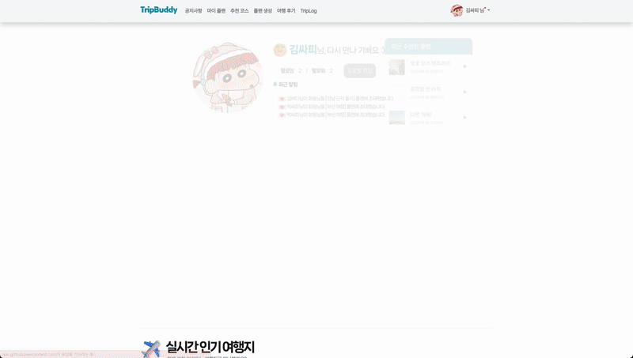
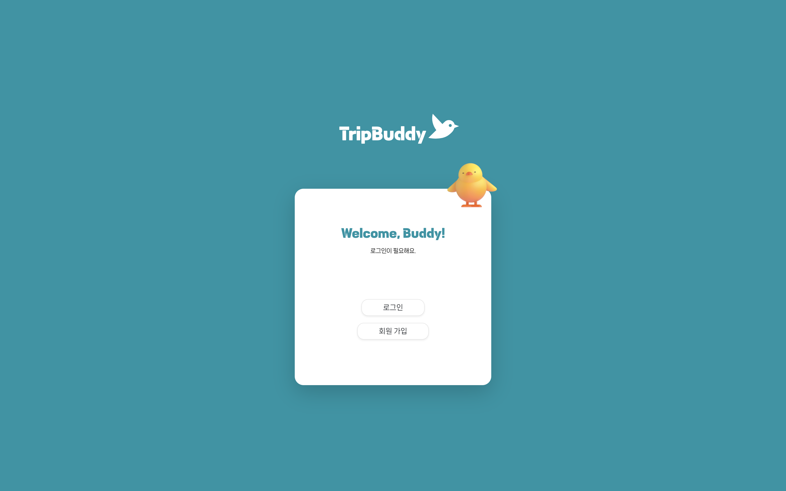
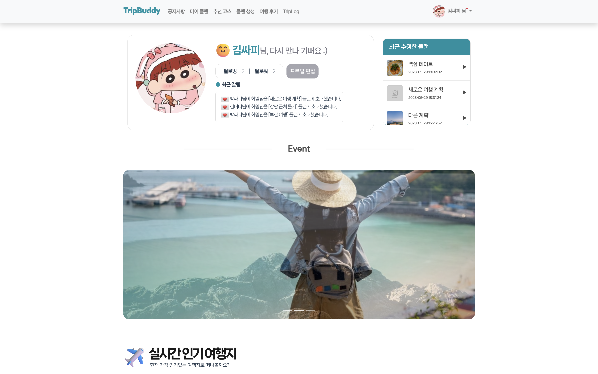
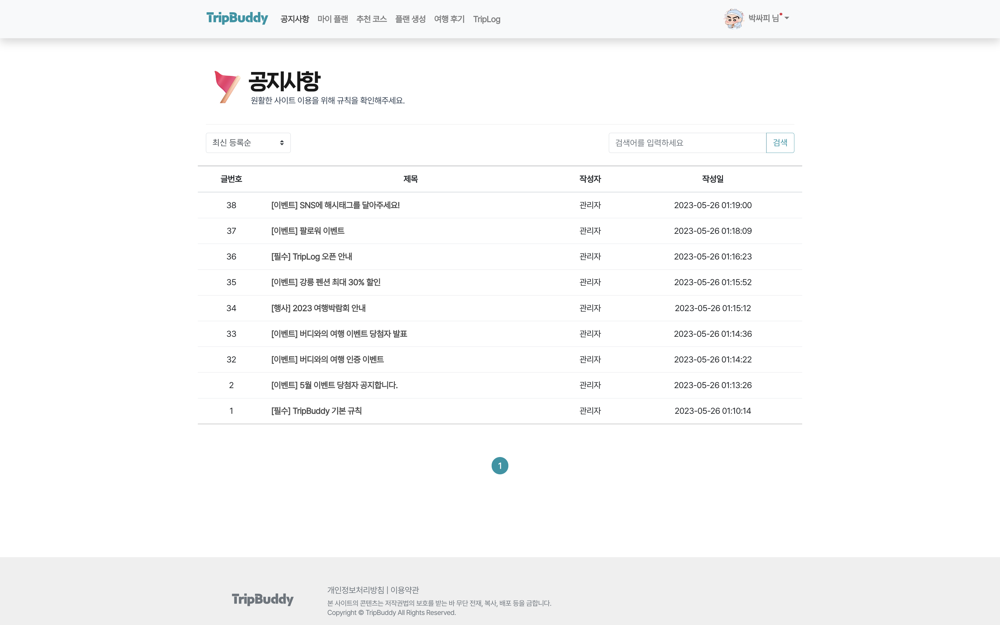
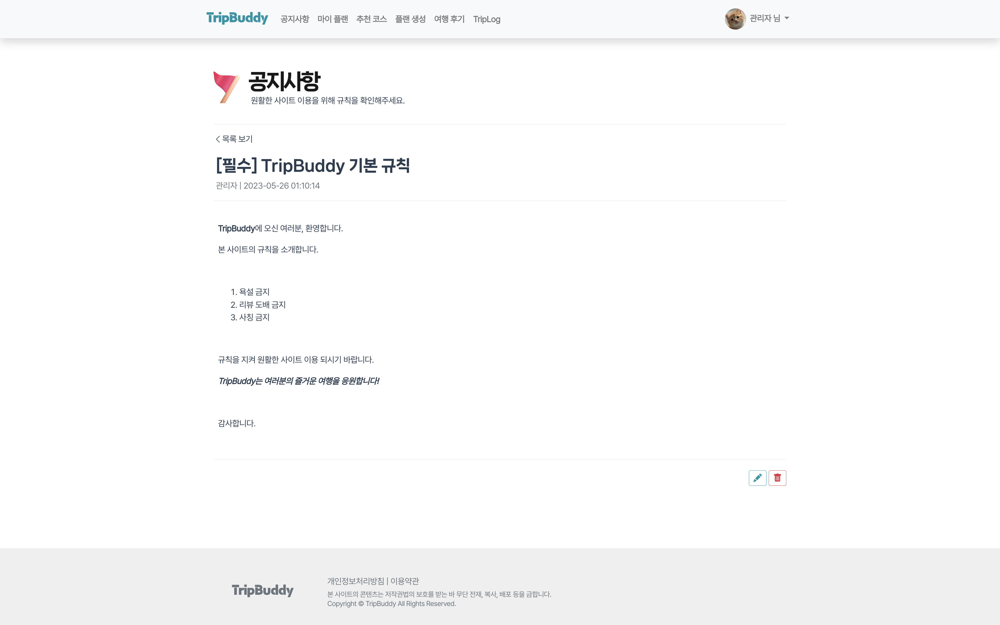
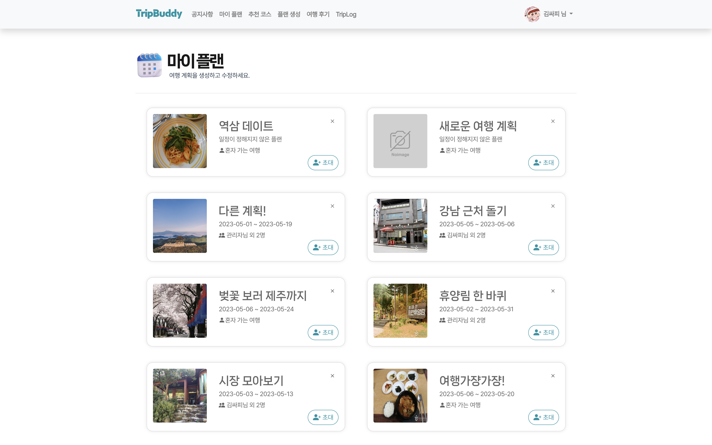
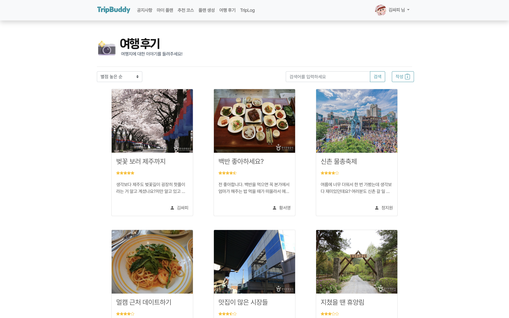
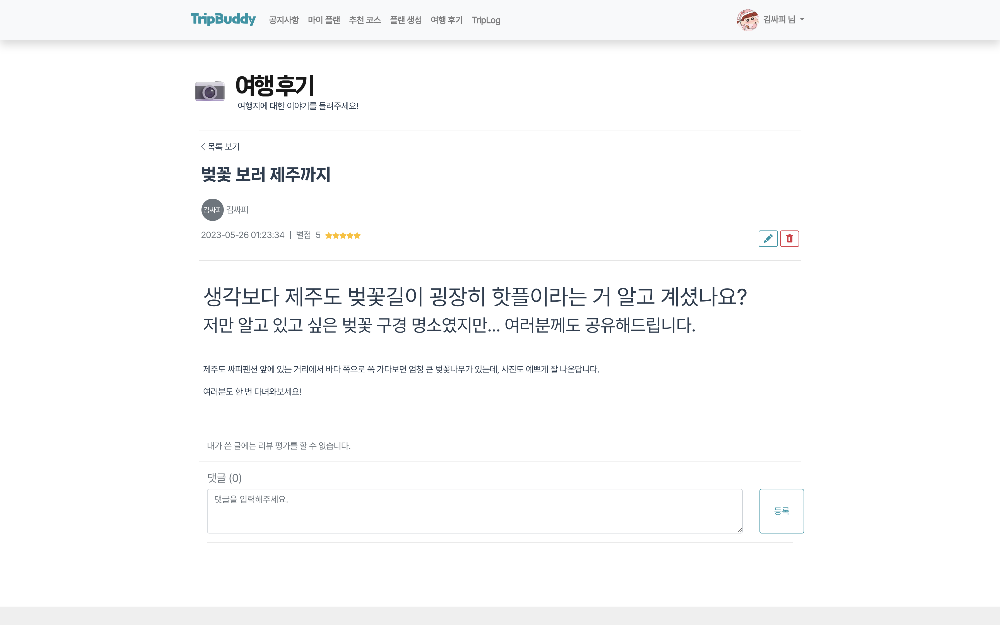
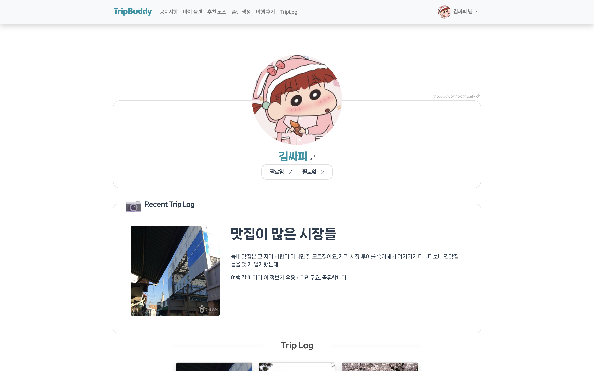

# 🐥 TripBuddy

| 초기 화면                              |
| -------------------------------------- |
|  |

**여행 계획(플랜)을 생성하고, 친구들과 공유해 함께 편집할 수 있는 웹 서비스**

| 메인 화면                              |
| -------------------------------------- |
|  |

| 실시간 통신 화면                       |
| -------------------------------------- |
|  |

여행 플랜을 수정할 때, 같은 플랜 멤버끼리 실시간 채팅 및 경로 변경을 진행할 수 있습니다.

---

## 시연 영상

- 타임라인 (클릭시 유튜브로 이동)
  - [회원가입 및 로그인](https://youtu.be/eVXOb6TZwgk?t=12)
  - [메인화면](https://youtu.be/eVXOb6TZwgk?t=28)
  - [공지사항](https://youtu.be/eVXOb6TZwgk?t=38)
  - [여행후기](https://youtu.be/eVXOb6TZwgk?t=55)
  - [마이페이지](https://youtu.be/eVXOb6TZwgk?t=85)
  - [알림기능](https://youtu.be/eVXOb6TZwgk?t=103)
  - [플랜수정 - 관광지 검색 및 경로 추가](https://youtu.be/eVXOb6TZwgk?t=130)
  - [플랜수정 - 관광지 찜 기능](https://youtu.be/eVXOb6TZwgk?t=166)
  - [플랜수정 - 관광지에 메모 등록](https://youtu.be/eVXOb6TZwgk?t=200)
  - [WebSocket 기반 실시간 통신 - 채팅](https://youtu.be/eVXOb6TZwgk?t=210)
  - [WebSocket 기반 실시간 통신 - 코스 변경](https://youtu.be/eVXOb6TZwgk?t=236)
  - [여행후기 작성](https://youtu.be/eVXOb6TZwgk?t=260)
  - [개인페이지 - 트립 로그](https://youtu.be/eVXOb6TZwgk?t=273)

---

# :computer: 담당한 역할

- 전체 사이트 기획 및 디자인
- 메인 페이지, 마이 플랜, 플랜 생성(편집), TripLog 페이지
  - **컴포넌트** 작성
  - **Axios를 사용한 비동기 API** 호출 및 이후 로직 처리
  - **WebSocket을 사용한 서버와의 실시간 통신 연결 및 로직 처리**

---

# :seedling: 기술 스택

- Vue.js
- NPM
- Axios
- WebSocket
- Git

---

# :hatching_chick: 주요 페이지 스크린샷

## 로그인 화면

---

## 메인 화면

---

## 공지사항

---

## 마이플랜

---

## 여행 후기

---

## 추천 코스

---

## 플랜 생성 및 편집

---

## TripLog

---
